# Comprehensive Benchmark CI Setup

This document explains the two-part CI benchmark system designed to prevent performance regressions and track historical performance data.

## 🏗️ Architecture Overview

Our benchmark CI system consists of two complementary workflows:

### 1. **PR Regression Check** (`pr_benchmark_check.yml`)
- **Purpose**: Gatekeeper to prevent performance regressions
- **Trigger**: Every pull request targeting `main` branch
- **Action**: Fails the build if statistically significant regression is detected

### 2. **Main Branch History Tracking** (`main_benchmark_history.yml`)
- **Purpose**: Long-term performance monitoring and visualization
- **Trigger**: Every push to `main` branch
- **Action**: Updates historical performance data and generates visual reports

## 🚦 How the PR Regression Check Works

### Workflow: `.github/workflows/pr_benchmark_check.yml`

```mermaid
graph TD
    A[PR Created] --> B[Checkout PR Code]
    B --> C[Install Rust & Cache]
    C --> D[Checkout Base Branch from PR]
    D --> E[Run Baseline Benchmarks]
    E --> F[Return to PR Branch]
    F --> G[Run PR Benchmarks]
    G --> H{Regression Detected?}
    H -->|Yes| I[❌ Fail Build + Comment]
    H -->|No| J[✅ Pass Build]
```



### Key Features:
- **Baseline Comparison**: Runs benchmarks on both the base branch (main) and PR branch
- **Statistical Analysis**: Uses Criterion's built-in regression detection
- **Automatic Failure**: Exits with non-zero status if significant regression is found
- **PR Comments**: Automatically comments on PRs with regression details
- **Artifact Upload**: Saves detailed benchmark results for manual analysis

### Environment Optimizations:
- `CRITERION_SAMPLE_SIZE: 10` - Reduces sample size for faster CI runs
- `timeout-minutes: 30` - Prevents hanging builds
- Concurrency control to prevent multiple benchmark jobs per PR

## 📈 How the Main Branch History Tracking Works

### Workflow: `.github/workflows/main_benchmark_history.yml`

```mermaid
graph TD
    A[Push to Main] --> B[Checkout Code]
    B --> C[Install Rust & Cache]
    C --> D[Run Benchmarks]
    D --> E[Compare with Historical Data]
    E --> F[Update gh-pages Branch]
    F --> G[Generate HTML Reports]
    G --> H[Commit Results]
    H --> I[📊 Visual History Available]
```



### Key Features:
- **Historical Tracking**: Maintains a complete performance history over time
- **Visual Reports**: Generates HTML charts showing performance trends
- **GitHub Pages Integration**: Automatically publishes reports to GitHub Pages
- **Commit Comments**: Adds performance summaries to commit messages
- **Long-term Artifacts**: Retains benchmark data for 90 days

### The `criterion-compare-action@v3` Magic:
This specialized action handles the complex workflow of:
1. Checking out the `gh-pages` branch
2. Running new benchmarks
3. Comparing against historical baselines
4. Generating HTML reports with charts
5. Committing updated results back to `gh-pages`

## 🎯 Benefits of This Two-Part System

### For Developers:
- **Immediate Feedback**: Know instantly if your PR causes regressions
- **Historical Context**: See how performance has evolved over time
- **Visual Trends**: Spot performance patterns and improvements

### For Maintainers:
- **Quality Gate**: Prevent accidental performance regressions from merging
- **Performance Monitoring**: Track library performance across releases
- **Data-Driven Decisions**: Make informed choices about optimizations

### For Users:
- **Performance Transparency**: Public performance history builds trust
- **Regression Prevention**: Confidence that performance won't degrade unexpectedly
- **Optimization Tracking**: See continuous performance improvements

## 🚀 Setup Instructions

### 1. Enable GitHub Pages
1. Go to your repository's **Settings** → **Pages**
2. Set source to **"Deploy from a branch"**
3. Select **`gh-pages`** branch as the source
4. Save the settings

> **Note**: The `gh-pages` branch will be automatically created after the first push to `main`.

### 2. Workflow Files
Both workflow files are already configured and ready to use:
- `.github/workflows/pr_benchmark_check.yml`
- `.github/workflows/main_benchmark_history.yml`

### 3. Benchmark Suites
The system automatically runs all benchmark suites:
- **In-Memory Benchmarks**: `benches/in_memory_benchmarks.rs`
- **Streaming Benchmarks**: `benches/streaming_benchmarks.rs`
- **HSSS Benchmarks**: `benches/hsss_benchmarks.rs`

## 📊 Accessing Performance Reports

Once set up, you can access performance reports at:
```
https://<username>.github.io/<repository-name>/
```

### Report Features:
- **Interactive Charts**: Hover for detailed metrics
- **Commit-by-Commit History**: See performance changes over time
- **Benchmark Breakdown**: Separate charts for each benchmark suite
- **Statistical Analysis**: Confidence intervals and regression detection

## 🔧 Customization Options

### Adjusting Regression Sensitivity
Criterion's regression detection can be tuned by modifying benchmark code:
```rust
// In your benchmark files
let mut group = c.benchmark_group("MyGroup");
group.significance_level(0.1);  // More sensitive (default: 0.05)
group.noise_threshold(0.02);    // Less noise tolerance (default: 0.01)
```

### Faster CI Runs
For faster PR checks, you can:
- Reduce `CRITERION_SAMPLE_SIZE` further
- Use `--profile test` instead of `--release` for benchmarks
- Run only critical benchmarks in PR checks

### Custom Benchmark Filters
To run specific benchmarks only:
```yaml
# In the workflow file
- name: Run specific benchmarks
  run: cargo bench --bench in_memory_benchmarks
```

## 🛠️ Troubleshooting

### Common Issues:

#### 1. **"gh-pages branch not found"**
- **Solution**: Push to `main` once to let the action create the branch

#### 2. **"Permission denied to push to gh-pages"**
- **Solution**: Ensure `permissions: contents: write` is set in the workflow

#### 3. **"Benchmarks taking too long"**
- **Solution**: Reduce `CRITERION_SAMPLE_SIZE` or add timeout limits

#### 4. **"False positive regressions"**
- **Solution**: Increase `noise_threshold` in benchmark configuration

### Debugging Steps:
1. Check workflow logs in the **Actions** tab
2. Download benchmark artifacts for detailed analysis
3. Review PR comments for specific regression details
4. Compare results manually using `cargo bench`

## 📝 Best Practices

### For Contributors:
- **Run benchmarks locally** before submitting PRs
- **Investigate regressions** rather than ignoring CI failures
- **Document intentional performance changes** in PR descriptions

### For Maintainers:
- **Review benchmark trends** regularly
- **Update baseline expectations** when making intentional changes
- **Monitor CI performance** to ensure reasonable run times

### For Performance:
- **Keep benchmarks focused** on critical code paths
- **Use realistic test data** that represents actual usage
- **Avoid micro-optimizations** that don't reflect real-world performance

## 🎉 Conclusion

This two-part benchmark CI system provides comprehensive performance monitoring while maintaining development velocity. It ensures that:

- ✅ **No regressions slip through** the review process
- ✅ **Performance history is preserved** and visualized
- ✅ **Developers get immediate feedback** on performance impact
- ✅ **Long-term trends are trackable** for informed decision-making

The system is designed to be low-maintenance while providing high-value performance insights for the `shamir_share` library.